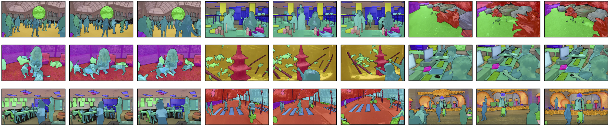
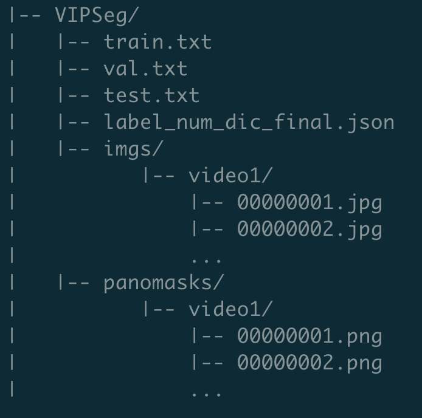

# CVPR 2022: Large-scale Video Panoptic Segmentation in the Wild: A Benchmark




### We thank [Video K-Net](https://github.com/lxtGH/Video-K-Net) which provides a strong baseline for VIPSeg dataset. This is a transformer-based model that achieves new SOTA.

## VIPSeg DataSet: A large-scale VIdeo Panoptic Segmentation dataset. 

*The download links of VIPSeg*

(20220621) We refined the annotations and further improved the quality of VIPSeg-Dataset.

```
Google Drive: https://drive.google.com/file/d/1B13QUiE82xf7N6nVHclb4ErN-Zuai-sZ/view?usp=sharing
```

```
Baidu YunPan: 链接：https://pan.baidu.com/s/18l05aTnsQCaiHYndSc8SaA 提取码：qllb 
```

## Instruction

The dataset is organized as following:




*NOTE: For panoptic masks in panomask/, the IDs of categories are from 0 to 124. "0" denotes the VOID class. For "stuff" classes, the value of masks is the same as the category ID. For "thing" classes, the value of masks  is "category_id x 100 + instance_id". For instance, the category ID of "person" is 61. Then values of masks of the "person" instances are "6100","6101",... Thus, values of masks larger than 124 are belonging to things, otherwise it is stuff.*


### Change VIPSeg to 720P and COCO Format

NOTE: The files "change2_720p.py,create_panoptic_video_labels.py,splitjson.py" are togethor with the dataset. Please download the dataset and unzip it.

```
pip install git+https://github.com/cocodataset/panopticapi.git

python change2_720p.py

python create_panoptic_video_labels.py

python splitjson.py

```


The COCO format dataset is organized as following:


*NOTE: The category IDs and colors are shown in panoVIPSeg_categories.json.*


## Baseline

This implementation is based on [PanopticFCN](https://github.com/dvlab-research/PanopticFCN). Please refer to [PanopticFCN](https://github.com/dvlab-research/PanopticFCN) for installation instructions. 

Download [pretrained weight](https://drive.google.com/file/d/1_VkJIhbQg9uqN49L3cDAW66zZKJE0fkI/view?usp=sharing) and put it in ClipPanoFCN.

```
cd ClipPanoFCN

sh run_train.sh

sh run_eval.sh

```

The model weight for inference can be downloaded [here](https://drive.google.com/file/d/1dLJyrWDrpqtsMn5ELAqY-nJqoj46TF35/view?usp=sharing). Put it in ./output


## Citation

```
@inproceedings{miao2022large,

  title={Large-scale Video Panoptic Segmentation in the Wild: A Benchmark},

  author={Miao, Jiaxu and Wang, Xiaohan and  Wu, Yu and Li, Wei and Zhang, Xu and Wei, Yunchao and Yang, Yi},

  booktitle={Proceedings of the {IEEE} Conference on Computer Vision and Pattern Recognition},

  year={2022}

}

@inproceedings{miao2021vspw,
  title={Vspw: A large-scale dataset for video scene parsing in the wild},
  author={Miao, Jiaxu and Wei, Yunchao and Wu, Yu and Liang, Chen and Li, Guangrui and Yang, Yi},
  booktitle={Proceedings of the IEEE/CVF Conference on Computer Vision and Pattern Recognition},
  pages={4133--4143},
  year={2021}
}
```

## License

The data is released for non-commercial research purpose only.


